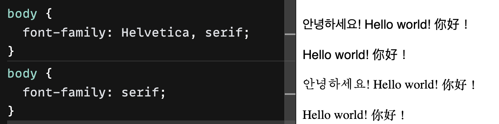

# font-family

### 형태

```css
font-family: "Roboto", sans-serif;
```

- 첫번째 인자로 Family name이 들어온다. 예시에서는 "Gill Sans" 
- Family name은 항상 큰 따옴표로 감싸진 string 이어야 한다.
- 큰 따옴표로 감싸지 않은 부분은 generic family. 여러 유형이 있다.
    - serif : 명조 폰트
    - sans-serif : 고딕 폰트
    - monospace : 고정된 글자 폭과 간격을 가진 폰트
    - cursive : 필기체
    - fantasy : 화려한 폰트
    - system-ui : OS의 시스템 폰트
- Generic family는 family name으로 지정된 글꼴을 사용할 수 없을 때 순차적으로 적용된다.

### 적용 예시



순차적으로 적용됨을 알 수 있다.


:::info

- [네이버 부스트코스 - font-family](https://www.boostcourse.org/cs120/lecture/92922?isDesc=false)
- [더 자세한 OS별 기본 시스템 폰트](https://granneman.com/webdev/coding/css/fonts-and-formatting/default-fonts)

:::
