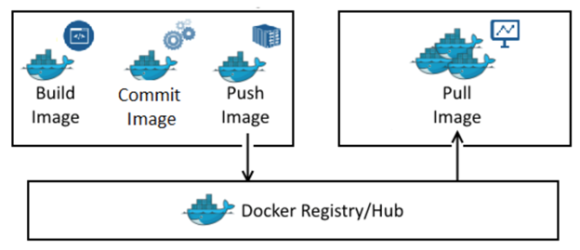

# Docker

## 도커란?

**컨테이너** 기반의 가상화 플랫폼. 요즘의 서버관리는 굉장히 복잡하다. (라이브러리 버전이 서로 달라서 실행이 안되거나 업데이트 하는 것에도 어려움이 있다.) 소프트웨어 실행환경을 가상 컨테이너에 담아 추상화하는 것이 도커의 핵심. 컨테이너만 있으면 서로 다른 컴퓨터에서도 항상 같은 환경위에서 소프트웨어를 돌릴 수 있다.

이제는 이런 질문을 안 해도 된다! 도커가 설치되어 있으면 어디서든 컨테이너를 실행할 수 있고, 서버 생성이 매우 간편해진다. 그리고 모든 서비스를 실행하는 방법, 배포하는 방식을 통일할 수 있다.

## 도커 이미지와 컨테이너

컨테이너를 실행하기 위한 압축파일. Dockerfile이라는 스크립트로 이미지를 만들어 [이미지 저장소](https://hub.docker.com/)에 저장해놓는다. 리눅스 서버에서 돌아가는 것들(MySQL, jenkins, node 같은 것들)은 대부분 이미지로 만들어져 있고, 그냥 가져다가 쓰면 되어서 편하다.  

도커 이미지를 실행한 상태를 컨테이너라고 한다. 컨테이너라는 격리된 공간에서 프로세스를 동작시킨다. 컨테이너는 삭제 후 새로 만들면 모든 데이터가 초기화 되며 데이터를 초기화 하고 싶지 않으면 별도의 저장소가 필요하다.

## 왜 사용하나?

- 이미지 관리가 쉽다.
- 다른 프로세스와 격리되어 VM처럼 사용하지만 성능저하가 거의 없다.
- 러닝커브가 리눅스에 비해 낮다.
- 이미지 빌드 기록을 남길 수 있다.
- 코드로 관리하기에 재현 및 수정이 가능하다.
- 오픈소스

